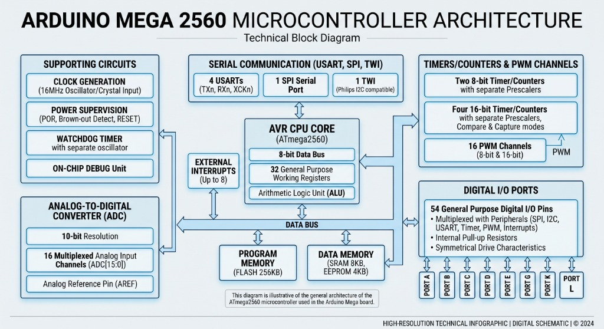
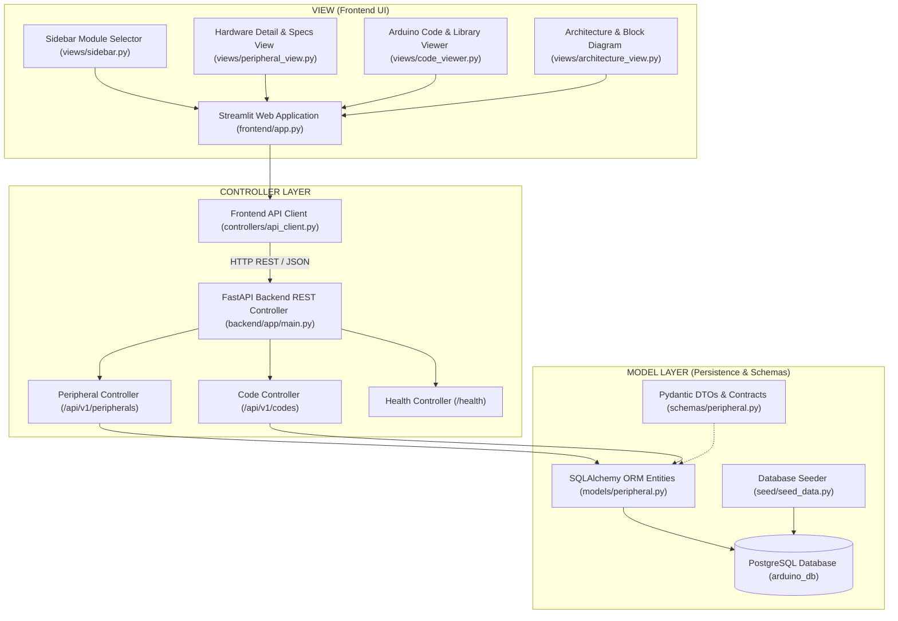
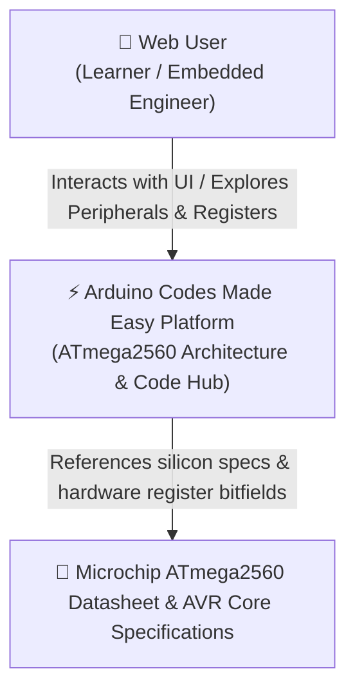
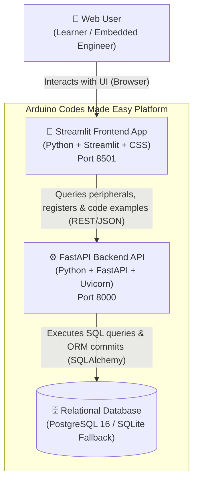
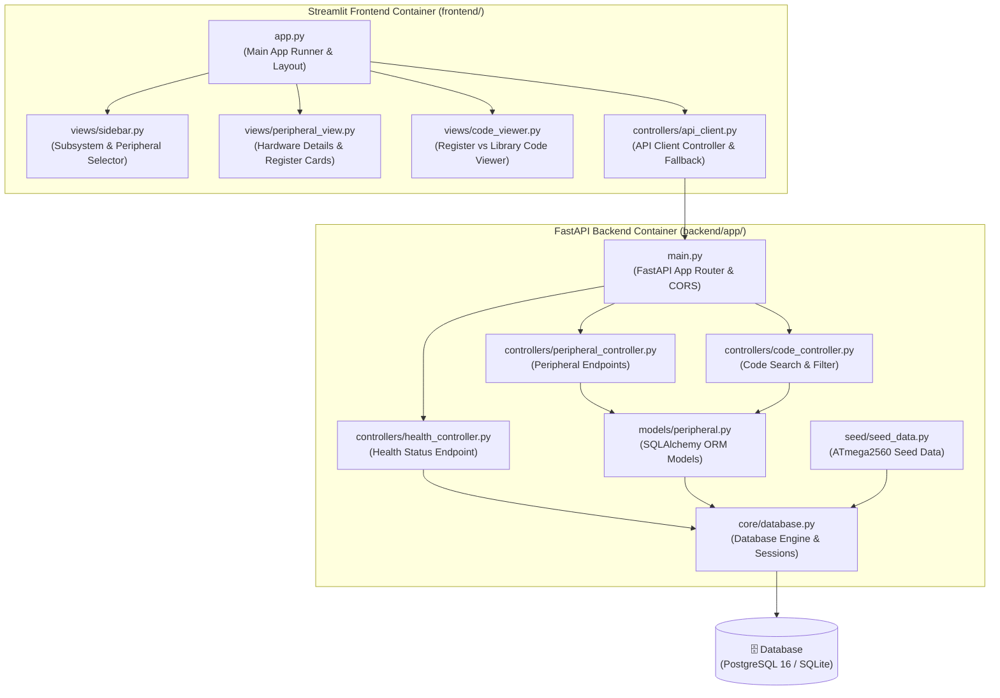
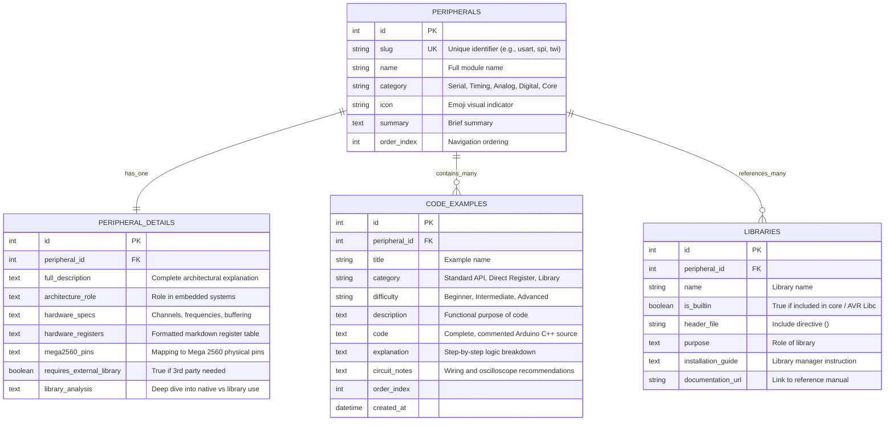

# Arduino codes made easy

> **Interactive ATmega2560 Microcontroller Architecture & Arduino Code Learning Hub**  
> Built with **Streamlit** (Frontend View), **FastAPI** (Backend Controller), and **PostgreSQL** (Relational Model), following a strict **MVC (Model-View-Controller)** architectural pattern.

---

## 📌 Project Purpose

Modern embedded development with Arduino often treats the microcontroller as a "black box" where functions like `digitalWrite()` or `analogRead()` hide the true silicon hardware under thick software layers. While convenient for quick prototypes, this abstraction makes it difficult for students, hobbyists, and engineers to understand how the microcontroller actually works.

**"Arduino codes made easy"** bridges this gap specifically for the **Microchip ATmega2560** (the heart of the Arduino Mega 2560). The application provides:

1. **Interactive Hardware Explorer**: Explore internal hardware modules (USART, SPI, TWI/I2C, Timers/Counters, PWM, ADC, External Interrupts, GPIO Ports, Watchdog, Memory).
2. **Library Clarification**: Clearly explains **which libraries can be used with Arduino** and **whether external libraries are necessary or if native Arduino Core / AVR Libc covers it**.
3. **Multi-Tier Code Examples**: Every peripheral offers both beginner-friendly standard Arduino API code and advanced register-level (bare-metal AVR C++) implementations with circuit diagrams and step-by-step logic breakdowns.
4. **Production MVC Architecture**: Built using a decoupled, scalable architecture with a FastAPI REST API backend, PostgreSQL database persistence, and a Streamlit frontend UI.

---

## 🔬 ATmega2560 Microcontroller Architecture & Subsystems

The application covers all key architectural blocks illustrated in the ATmega2560 hardware block diagram:



### 1. Serial Communication Block
- **4 USARTs (`USART0` to `USART3`)**: Four independent hardware serial ports. `Serial` (USART0) is mapped to Pins 0/1 and connected to the onboard USB-to-serial converter. `Serial1` (Pins 19/18), `Serial2` (Pins 17/16), and `Serial3` (Pins 15/14) connect directly to external GPS, Bluetooth, ESP8266, and GSM modules simultaneously.
- **1 SPI Port**: High-speed synchronous 4-wire serial bus on Pins 50 (MISO), 51 (MOSI), 52 (SCK), and 53 (SS). Runs at up to 8 MHz for SD cards, Ethernet shields (W5500), and TFT displays.
- **1 TWI / I2C Bus**: Hardware Two-Wire Interface compatible with Philips I2C on Pins 20 (SDA) and 21 (SCL). Supports 100 kHz standard and 400 kHz fast mode with 7-bit and 10-bit addressing.

### 2. Timers/Counters & PWM Channels
- **Two 8-bit Timers (Timer 0, Timer 2)**: Timer 0 serves as the Arduino core timekeeper (`millis()`, `micros()`). Timer 2 features an asynchronous mode that can be clocked by a 32.768 kHz watch crystal on TOSC1/TOSC2 pins for low-power Real-Time Clocks.
- **Four 16-bit Timers (Timer 1, Timer 3, Timer 4, Timer 5)**: High-resolution timers equipped with Clear Timer on Compare (CTC) and Input Capture pins (ICP1, ICP4, ICP5) for precision frequency measurement and sub-microsecond pulse timing.
- **16 Hardware PWM Channels**: Pins 2–13 and 44–46 generate hardware PWM. Configurable between 8-bit standard `analogWrite()` and custom high-speed 25 kHz silent motor/fan control via direct timer register setup.

### 3. Analog-to-Digital Converter (ADC)
- **16 Channels (A0 to A15)**: Successive approximation 10-bit converter (0–1023 values).
- **Multiple Voltage References**: Default 5V AVCC, external AREF, and ATmega2560 exclusive internal references: `INTERNAL1V1` (1.1V bandgap) and `INTERNAL2V56` (2.56V precision reference for doubling analog sensitivity).
- **Differential Inputs & Programmable Gain**: Hardware 10x and 200x gain stages for reading low-voltage sensors.

### 4. Digital I/O & Port Manipulation
- **54 Digital I/O Pins**: Grouped into eleven 8-bit registers (Port A through Port L).
- **Direct Port Access**: Replacing `digitalWrite()` (~50 clock cycles / 3.1 µs) with single-cycle register manipulation (`PORTx`, `DDRx`, `PINx`) allows maximum-speed 8 MHz square wave generation in 62.5 nanoseconds.

### 5. Watchdog Timer & Supporting Circuits
- **Independent 128 kHz RC Oscillator**: Runs completely isolated from the main 16 MHz crystal.
- **Fail-Safe Operation**: Provides selectable timeout intervals from 16 ms to 8 seconds to reset the system if an unhandled deadlock or crash occurs, or trigger periodic interrupt wakeups from sleep mode.

### 6. Memory Hierarchy
- **256 KB Flash**: Stores bootloader and firmware. Large lookup tables can be kept here using the `PROGMEM` macro to prevent SRAM starvation.
- **8 KB SRAM**: Stores runtime variables, dynamically allocated objects, and execution stack.
- **4 KB EEPROM**: Byte-addressable non-volatile memory with 100,000 write cycle endurance for saving calibration parameters and device IDs.

---

## 🏛️ General System Architecture (MVC)

The project adheres to the **Model-View-Controller (MVC)** architectural pattern:



---

## 📊 C4 Model Architecture Diagrams

The system architecture is structured according to the **C4 Model** (Context, Container, Component, and Code).

### Level 1: System Context Diagram
High-level overview of users interacting with the ATmega2560 learning portal.



---

### Level 2: Container Diagram
High-level technological boundaries separating Streamlit UI, FastAPI Backend, and Database.



---

### Level 3: Component Diagram
Breaks down the internal components of both the FastAPI Backend and Streamlit Frontend containers.



---

### Level 4: Code & Data Model Diagram (Entity-Relationship)
Represents the normalized PostgreSQL database schema designed for the platform:



---

## 🚀 Quick Start Guide

### Prerequisites
- **Python 3.11+**
- **uv** (recommended for ultra-fast dependency management) or standard `pip`
- **Docker & Docker Compose** (for PostgreSQL database)

---

### Step 1: Clone and Set Up Dependencies

Using `uv` (recommended):
```powershell
# Sync project dependencies
uv sync --system-certs
```

Or using standard `pip`:
```powershell
pip install -r requirements.txt  # Or install directly from pyproject.toml
```

---

### Step 2: Start the PostgreSQL Database

Run PostgreSQL 16 using Docker Compose:
```powershell
docker compose up -d
```

> **Automatic Fallback Note**: If Docker or PostgreSQL is not currently running, the application includes an automated fallback mechanism that boots from a local SQLite database (`arduino_mega.db`) so you can explore and test the platform immediately with zero setup friction!

---

### Step 3: Populate Database with ATmega2560 Data

Execute the seed script to create tables and insert all 10 ATmega2560 peripherals and code examples:
```powershell
uv run python -m backend.app.seed.run_seed
```

---

### Step 4: Run the Backend and Frontend

Open two terminal windows:

#### Terminal 1: Launch FastAPI Backend Server
```powershell
uv run uvicorn backend.app.main:app --host 127.0.0.1 --port 8000 --reload
```
- Interactive OpenAPI Docs: `http://127.0.0.1:8000/docs`
- Health Check: `http://127.0.0.1:8000/health`

#### Terminal 2: Launch Streamlit Web Application
```powershell
uv run streamlit run frontend/app.py
```
- Streamlit Web App: `http://localhost:8501`

---

## 🧪 Running Automated Tests

Run the automated test suite with `pytest`:
```powershell
uv run pytest tests/ -v
```

---

## 📂 Project Directory Structure

```
e:/PROJECTS/ARDUINO_CODES/
├── README.md                          # Comprehensive documentation with C4 diagrams
├── docker-compose.yml                 # PostgreSQL 16 Alpine service definition
├── pyproject.toml                     # Project dependencies managed with uv
├── .env.example                       # Environment configuration template
├── .env                               # Local active environment configuration
├── assets/                            # Architecture diagrams and UI wireframes
│   ├── atmega2560_architecture.jpg    # ATmega2560 block diagram
│   ├── ui_wireframe.png               # Handwritten UI layout sketch
│   └── mvc_sketch.png                 # Handwritten MVC & DB architecture sketch
├── backend/                           # FastAPI Application (MVC Backend / API)
│   └── app/
│       ├── main.py                    # FastAPI entrypoint, CORS, startup lifecycle
│       ├── core/
│       │   ├── config.py              # Pydantic Settings
│       │   └── database.py            # SQLAlchemy engine, session factory, fallback
│       ├── models/
│       │   └── peripheral.py          # Relational ORM models (Peripherals, Codes, Libs)
│       ├── schemas/
│       │   └── peripheral.py          # Pydantic data schemas & serialization
│       ├── controllers/
│       │   ├── peripheral_controller.py # /api/v1/peripherals endpoints
│       │   ├── code_controller.py       # /api/v1/codes endpoints
│       │   └── health_controller.py     # /health endpoint
│       └── seed/
│           ├── seed_data.py           # Rich ATmega2560 technical content & codes
│           └── run_seed.py            # Seed script
├── frontend/                          # Streamlit Application (MVC View & Client Controller)
│   ├── app.py                         # Main Streamlit web application
│   ├── controllers/
│   │   └── api_client.py              # API client communicating with FastAPI
│   ├── views/
│   │   ├── sidebar.py                 # Peripheral selection sidebar matching sketch
│   │   ├── peripheral_view.py         # Hardware descriptions, registers, pinouts
│   │   ├── code_viewer.py             # Library requirements & Arduino code tabs
│   │   └── architecture_view.py       # Block diagram & MVC system visualizer
│   └── static/
│       └── styles.css                 # Custom CSS styling
└── tests/
    └── test_api.py                    # Automated test suite
```

---

## 📄 License & Attribution
Developed for learners and engineers mastering embedded systems programming on the **Microchip ATmega2560 / Arduino Mega 2560**.
